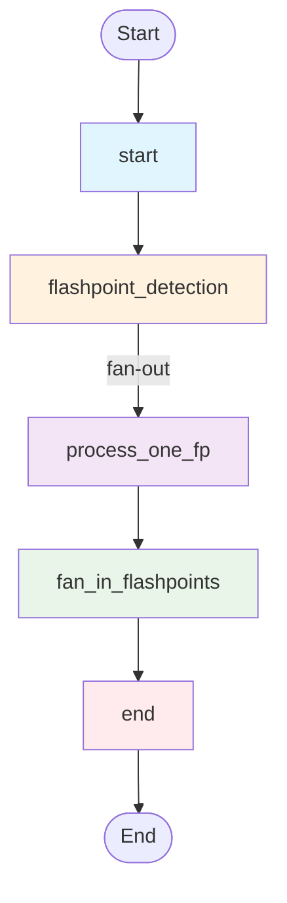
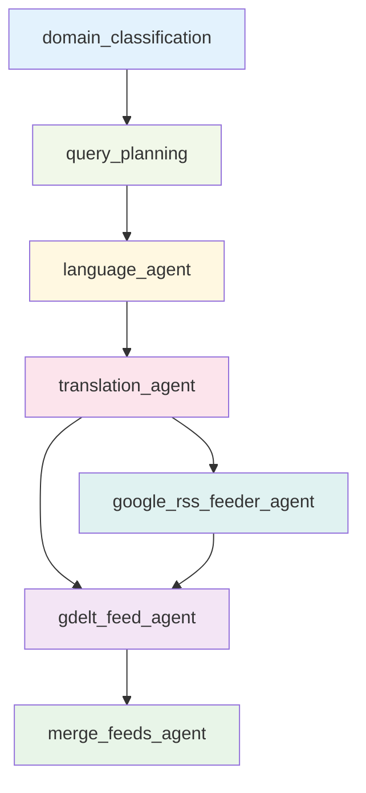
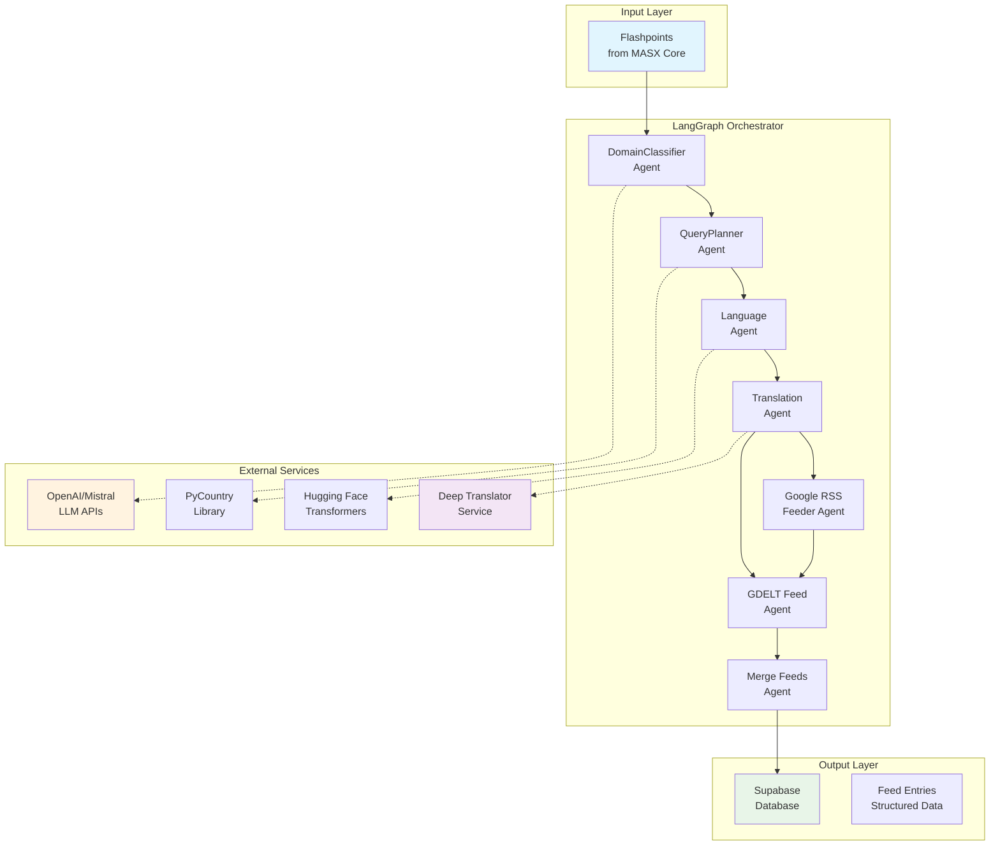
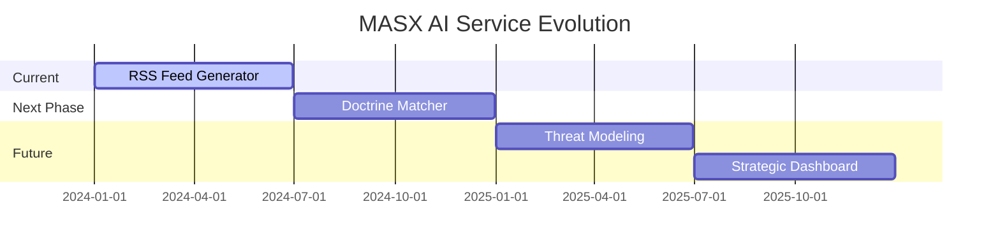

# ┌───────────────────────────────────────────────────────────────┐
# │  Copyright (c) 2025 Ateet Vatan Bahmani                      │
# │  Project: MASX AI – Strategic Agentic AI System              │
# │  All rights reserved.                                        │
# └───────────────────────────────────────────────────────────────┘
#
# MASX AI is a proprietary software system developed and owned by Ateet Vatan Bahmani.
# The source code, documentation, workflows, designs, and naming (including "MASX AI")
# are protected by applicable copyright and trademark laws.
#
# Redistribution, modification, commercial use, or publication of any portion of this
# project without explicit written consent is strictly prohibited.
#
# This project is not open-source and is intended solely for internal, research,
# or demonstration use by the author.
#
# Contact: ab@masxai.com | MASXAI.com

# 🛰️ MASX AI – RSS Feeder Service

> **Agentic LangGraph pipeline for multilingual RSS query generation and geopolitical flashpoint aggregation.**

[](https://www.python.org/downloads/)
[](https://github.com/langchain-ai/langgraph)
[](https://fastapi.tiangolo.com/)
[](https://opensource.org/licenses/MIT)

---

## 📋 Overview

In today's fragmented information landscape, geopolitical events emerge across multiple languages, sources, and timeframes, creating chaos for intelligence gathering and strategic decision-making. The **MASX AI RSS Feeder Service** addresses this challenge through an intelligent, agentic pipeline that automatically detects geopolitical flashpoints and generates comprehensive multilingual news feeds for each event.

### 🎯 Core Mission

This service transforms raw geopolitical events into structured, multilingual RSS feeds by:

- **Detecting Flashpoints**: Identifying critical geopolitical events from global news sources
- **Multilingual Processing**: Expanding queries across 50+ languages using advanced translation
- **Parallel Aggregation**: Combining Google News RSS and GDELT data sources
- **Intelligent Filtering**: Applying domain classification and relevance scoring
- **Structured Output**: Delivering clean, categorized feeds to downstream systems

### 🏗️ Architecture Philosophy

Designed as a modular component within the **MASX Global Signal Grid** stack, this service exemplifies modern AI orchestration patterns using LangGraph's state management, parallel processing, and agent coordination capabilities.

---

## 🧭 LangGraph Workflow Architecture

### Main Workflow Orchestration



### Per-Flashpoint Subgraph Processing



---

## 🏛️ System Architecture



---

## 🛠️ Technology Stack

### 🤖 **AI/ML & Agent Frameworks**
- **LangGraph 0.5.1** - State management and agent orchestration
- **LangChain 0.3.26** - LLM integration and prompt management
- **LangChain-OpenAI 0.3.27** - OpenAI integration
- **LangChain-Community 0.3.27** - Community integrations
- **CrewAI 0.140.0** - Multi-agent collaboration framework
- **AutoGen 0.9.5** - Conversational AI framework
- **OpenAI 1.93.0** - GPT-4 and embedding models
- **TikToken 0.9.0** - Token counting and cost tracking

### 🌐 **Web Framework & API**
- **FastAPI 0.115.14** - High-performance async API framework
- **Uvicorn 0.35.0** - ASGI server with WebSocket support
- **Starlette 0.46.2** - ASGI toolkit
- **Pydantic 2.11.7** - Data validation and serialization
- **Pydantic-Settings 2.10.1** - Settings management
- **HTTPX 0.28.1** - Async HTTP client

### 🗄️ **Database & Vector Storage**
- **Supabase 2.16.0** - PostgreSQL with real-time capabilities
- **PostgREST 1.1.1** - REST API for PostgreSQL
- **pgvector 0.4.1** - Vector similarity search
- **psycopg2-binary 2.9.10** - PostgreSQL adapter
- **asyncpg 0.30.0** - Async PostgreSQL driver
- **SQLAlchemy 2.0.41** - ORM and database toolkit

### 🔍 **NLP & Language Processing**
- **SpaCy 3.8.7** - Industrial-strength NLP pipeline
- **Transformers 4.53.1** - Hugging Face model library
- **Torch 2.7.1** - PyTorch deep learning framework
- **Sentence-Transformers 5.0.0** - Text embeddings
- **NLTK 3.9.1** - Natural language toolkit
- **TextBlob 0.19.0** - Text processing library
- **jieba3k 0.35.1** - Chinese text segmentation

### 🌍 **Translation & Language Services**
- **Deep-Translator 1.11.4** - Multi-provider translation
- **LangDetect 1.0.9** - Language detection
- **PyCountry 24.6.1** - Country and language data
- **Country-Converter 1.3** - Country code conversion
- **LangCodes 3.5.0** - Language code utilities

### 📰 **News & Data Sources**
- **FeedParser 6.0.11** - RSS/Atom feed processing
- **Newspaper3k 0.2.8** - Article extraction and parsing
- **GDELTDoc 1.12.0** - GDELT API client
- **Requests 2.32.4** - HTTP library
- **AioHTTP 3.12.13** - Async HTTP client/server

### 📊 **Data Processing & Analytics**
- **Pandas 2.3.0** - Data manipulation and analysis
- **NumPy 2.3.1** - Numerical computing
- **Scikit-Learn 1.7.0** - Machine learning
- **SciPy 1.16.0** - Scientific computing
- **Plotly 6.2.0** - Interactive visualizations
- **NetworkX 3.5** - Graph analysis

### 🔧 **Text Processing & Similarity**
- **FuzzyWuzzy 0.18.0** - Fuzzy string matching
- **RapidFuzz 3.13.0** - Fast fuzzy string matching
- **Python-Levenshtein 0.27.1** - String similarity
- **Regex 2024.11.6** - Advanced regex operations

### 🚀 **Async & Concurrency**
- **Asyncio** - Asynchronous programming
- **Asyncio-Throttle** - Rate limiting
- **AioHappyEyeballs** - Happy eyeballs algorithm
- **ThreadPoolExecutor** - Thread-based parallelism

### 📝 **Development & Quality**
- **Black 25.1.0** - Code formatting
- **isort 6.0.1** - Import sorting
- **Flake8 7.3.0** - Linting
- **MyPy 1.16.1** - Static type checking
- **Pre-Commit 4.2.0** - Git hooks
- **Pytest 8.4.1** - Testing framework
- **Pytest-Asyncio 1.0.0** - Async testing
- **Coverage 7.9.2** - Test coverage

### 📚 **Documentation & Monitoring**
- **MkDocs 1.6.1** - Documentation generator
- **MkDocs-Material 9.6.15** - Material theme
- **Structlog 25.4.0** - Structured logging
- **OpenTelemetry** - Observability framework
- **PostHog 5.4.0** - Product analytics

### 🔐 **Security & Authentication**
- **PyJWT 2.10.1** - JSON Web Tokens
- **Cryptography 45.0.5** - Cryptographic recipes
- **bcrypt 4.3.0** - Password hashing
- **OAuthLib 3.3.1** - OAuth implementation

### 🐳 **Containerization & Deployment**
- **Docker** - Containerization
- **Python 3.12-slim** - Base image
- **Build-Essential** - Compilation tools
- **libpq-dev** - PostgreSQL development

### 🔄 **Utilities & Helpers**
- **Tenacity 9.1.2** - Retry logic and resilience
- **Python-Dotenv 1.1.1** - Environment management
- **Rich 14.0.0** - Rich text and formatting
- **Click 8.2.1** - Command line interface
- **Typer 0.16.0** - CLI framework
- **Watchdog 6.0.0** - File system monitoring
- **WatchFiles 1.1.0** - File watching

---

## ✨ Key Features

### 🔄 Parallelized Flashpoint Processing
- **Fan-out/Fan-in Pattern**: Process multiple flashpoints concurrently using LangGraph's parallel execution
- **State Management**: Maintains consistent state across distributed agent execution
- **Error Isolation**: Individual flashpoint failures don't affect the entire pipeline

### 🌍 Multilingual Intelligence
- **50+ Language Support**: Automatic query expansion across major world languages
- **Translation-Aware URLs**: Generate language-specific RSS feeds for Google News
- **Cultural Context**: Adapt queries based on regional news patterns and terminology

### 📡 Dual-Source Aggregation
- **Google News RSS**: Real-time news from Google's global news index
- **GDELT Events**: Structured event data from the Global Database of Events, Language, and Tone
- **Intelligent Merging**: Deduplication and relevance scoring across sources

### 🧠 Agentic Intelligence
- **Domain Classification**: Categorize flashpoints by geopolitical domain (conflict, trade, diplomacy, etc.)
- **Query Planning**: Generate optimized search queries based on event context
- **Language Detection**: Automatically identify relevant languages for each flashpoint

### 🚀 Production-Ready Features
- **Rate Limiting**: Thread-safe rate limiting for external API calls
- **Retry Logic**: Exponential backoff with configurable retry attempts
- **Structured Logging**: JSON-formatted logs with correlation IDs
- **Health Monitoring**: Comprehensive health checks and metrics

---

## 🚀 Quick Start

### Prerequisites

- Python 3.12 or higher
- Git
- API keys for OpenAI/Mistral, Google Search, GDELT, and Supabase

### Installation

1. **Clone the repository**
   ```bash
   git clone https://github.com/masx-ai/ai-global-signal-grid.git
   cd ai-global-signal-grid/modules/ai-global-signal-grid
   ```

2. **Create virtual environment**
   ```bash
   python -m venv venv
   source venv/bin/activate  # On Windows: venv\Scripts\activate
   ```

3. **Install dependencies**
   ```bash
   pip install -e .
   ```

4. **Configure environment**
   ```bash
   cp env.example .env
   # Edit .env with your API keys and configuration
   ```

5. **Run the service**
   ```bash
   # Start the FastAPI server
   python -m src.main
   
   # Or use uvicorn directly
   uvicorn src.main:app --host 0.0.0.0 --port 8000 --reload
   ```

### Environment Configuration

Create a `.env` file with the following essential variables:

```env
# LLM Configuration (Required)
MISTRAL_API_KEY=your_mistral_api_key_here
OPENAI_API_KEY=your_openai_api_key_here

# Database Configuration (Required)
SUPABASE_URL=https://your-project.supabase.co
SUPABASE_ANON_KEY=your_supabase_anon_key_here
SUPABASE_SERVICE_ROLE_KEY=your_supabase_service_role_key_here

# External APIs (Required)
GOOGLE_SEARCH_API_KEY=your_google_custom_search_api_key_here
GOOGLE_CX=your_google_custom_search_engine_id_here
GDELT_API_KEY=your_gdelt_api_key_here

# Translation Services (Optional)
GOOGLE_TRANSLATE_API_KEY=your_google_translate_api_key_here
DEEPL_API_KEY=your_deepl_api_key_here

# Environment
ENVIRONMENT=development
DEBUG=true
LOG_LEVEL=INFO
```

### API Endpoints

Once running, the service provides these key endpoints:

- **Health Check**: `GET /health`
- **Workflow Status**: `GET /api/workflows/status`
- **Run Daily Workflow**: `POST /api/workflows/daily`
- **Flashpoint Data**: `GET /api/data/flashpoints`
- **Feed Entries**: `GET /api/data/feeds`

---

## 📁 Project Structure

```
masx-ai-server/
├── src/
│   ├── app/
│   │   ├── agents/                 # LangGraph agent implementations
│   │   │   ├── base.py            # Base agent class
│   │   │   ├── domain_classifier.py
│   │   │   ├── query_planner.py
│   │   │   ├── language_agent.py
│   │   │   ├── translator.py
│   │   │   ├── google_rss_agent.py
│   │   │   └── gdelt_fetcher_agent.py
│   │   ├── workflows/
│   │   │   └── orchestrator.py    # Main LangGraph workflow
│   │   ├── services/              # Business logic services
│   │   │   ├── data_sources.py
│   │   │   ├── translation.py
│   │   │   ├── llm_service.py
│   │   │   └── database.py
│   │   ├── core/                  # Core data models and utilities
│   │   │   ├── flashpoint.py
│   │   │   ├── state.py
│   │   │   ├── querystate.py
│   │   │   └── exceptions.py
│   │   ├── config/                # Configuration management
│   │   │   ├── settings.py
│   │   │   └── logging_config.py
│   │   └── api/                   # FastAPI application
│   │       ├── app.py
│   │       └── routes/
│   ├── main.py                    # Application entry point
│   └── __init__.py
├── tests/                         # Test suite
├── requirements.txt               # Python dependencies
├── pyproject.toml                # Project configuration
├── Dockerfile                    # Container configuration
└── README.md                     # This file
```

---

## 📊 Sample Output

The service produces structured feed entries in the following format:

```json
{
  "flashpoint_id": "fp_2024_01_15_001",
  "title": "Escalating Tensions in South China Sea",
  "description": "Recent military exercises and territorial disputes",
  "entities": ["China", "Philippines", "United States"],
  "domains": ["military", "diplomacy", "territorial"],
  "queries": [
    {
      "query_original": "South China Sea tensions military exercises",
      "query_translated": "南中国海紧张局势军事演习",
      "language": "zh",
      "rss_url": "https://news.google.com/rss/search?q=南中国海紧张局势军事演习&hl=zh",
      "feed_entries": [
        {
          "url": "https://example.com/article1",
          "title": "China Conducts Military Exercises in Disputed Waters",
          "description": "Beijing demonstrates military capabilities...",
          "source_language": "zh",
          "published_date": "2024-01-15T10:30:00Z",
          "relevance_score": 0.92,
          "domain": "military"
        }
      ]
    }
  ],
  "aggregated_feeds": {
    "google_rss_count": 15,
    "gdelt_count": 8,
    "total_articles": 23,
    "languages_covered": ["en", "zh", "ja", "ko"],
    "processing_time": "45.2s"
  }
}
```

---

## 🗺️ Future Roadmap

### Current Phase: RSS Feed Generation


### 🎯 Strategic Applications

#### Real-Time Intelligence
- **Crisis Alert Feeds**: Automated alerts for NGOs and government agencies
- **Early Warning Systems**: Predictive analysis of emerging conflicts
- **Media Monitoring**: Real-time tracking of geopolitical narratives

#### Strategic Decision Support
- **Policy Analysis**: Impact assessment of geopolitical events
- **Risk Assessment**: Quantified risk scoring for global events
- **Scenario Planning**: AI-powered scenario generation and analysis

#### AI Integration
- **Journalism Automation**: Automated news aggregation and fact-checking
- **Defense Intelligence**: Enhanced situational awareness for defense applications
- **Academic Research**: Large-scale geopolitical event analysis

---

## 🤝 Contributing

We welcome contributions from the community! Please follow these guidelines:

### Development Setup

1. **Fork the repository**
2. **Create a feature branch**: `git checkout -b feature/amazing-feature`
3. **Install development dependencies**: `pip install -e ".[dev]"`
4. **Run tests**: `pytest tests/`
5. **Format code**: `black src/ tests/`
6. **Commit changes**: Follow conventional commit format

### Commit Convention

- `feat:` - New features
- `fix:` - Bug fixes
- `docs:` - Documentation updates
- `refactor:` - Code refactoring
- `test:` - Test additions or updates
- `chore:` - Maintenance tasks

### Code Quality

- **Type Hints**: All functions must include type annotations
- **Docstrings**: Comprehensive docstrings for all public APIs
- **Tests**: Maintain >90% test coverage
- **Linting**: Code must pass `flake8` and `mypy` checks

---

## 📄 License

This project is licensed under the MIT License - see the [LICENSE](LICENSE) file for details.

---

## 🔗 Related Projects

- **[MASX Core](https://github.com/masx-ai/masx-core)** - Core flashpoint detection engine
- **[MASX Dashboard](https://github.com/masx-ai/masx-dashboard)** - Real-time visualization interface
- **[MASX API Gateway](https://github.com/masx-ai/masx-gateway)** - Unified API management

---

## 📞 Support

- **Documentation**: [docs.masx.ai](https://docs.masx.ai)
- **Issues**: [GitHub Issues](https://github.com/masx-ai/ai-global-signal-grid/issues)
- **Discussions**: [GitHub Discussions](https://github.com/masx-ai/ai-global-signal-grid/discussions)
- **Email**: support@masxai.com

---

*Built with ❤️ by the MASX AI Team*
