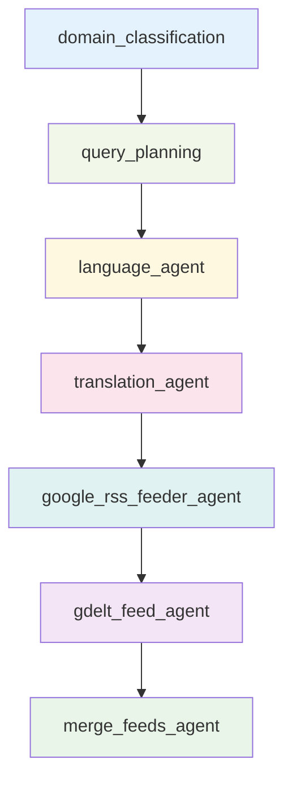
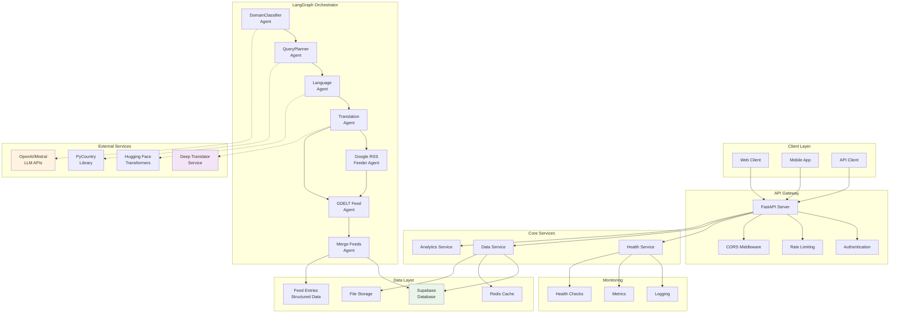
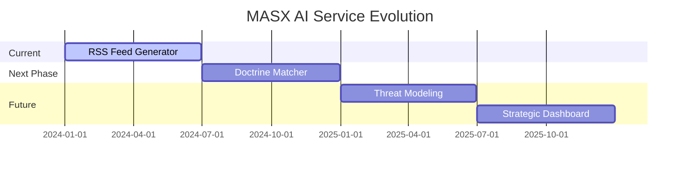

<div align="center">

# 🛰️ MASX AI – Global Signal Grid (GSG)

**Copyright (c) 2025 Ateet Vatan Bahmani**  
**Project: MASX AI – Strategic Agentic AI System**  
**All rights reserved.**

**MASX AI** is a proprietary software system developed and owned by **Ateet Vatan Bahmani**.

The source code, documentation, workflows, designs, and naming (including "MASX AI") are protected by applicable copyright and trademark laws.

**Redistribution, modification, commercial use, or publication of any portion of this project without explicit written consent is strictly prohibited.**

This project is **not open-source** and is intended solely for internal, research, or demonstration use by the author.

**Contact:** [ab@masxai.com](mailto:ab@masxai.com) | [MASXAI.com](https://masxai.com)

---

</div>

# 🛰️ MASX AI – Global Signal Grid (GSG)

> **Autonomous Global Intelligence Platform** - 24/7 flashpoint detection, analysis, and forecasting using multi-agent AI orchestration with comprehensive API access

[](https://www.python.org/downloads/)
[](https://github.com/langchain-ai/langgraph)
[](https://fastapi.tiangolo.com/)
[](LICENSE)

---

## 📋 Table of Contents

- [Overview](#-overview)
- [System Architecture](#-system-architecture)
- [Core Components](#-core-components)
- [Features](#-features)
- [Technology Stack](#-technology-stack)
- [Installation](#-installation)
- [Usage](#-usage)
- [API Documentation](#-api-documentation)
- [Docker Deployment](#-docker-deployment)
- [Development](#-development)
- [Roadmap](#-roadmap)
- [Contributing](#-contributing)
- [License](#-license)

---

## 🎯 Overview

**MASX AI Global Signal Grid (GSG)** is a proprietary strategic intelligence system that autonomously monitors, analyzes, and forecasts global geopolitical flashpoints using advanced multi-agent AI orchestration.

The system performs a full-scale internet scan daily at 00:00 UTC, continuously processing real-time geopolitical data to detect, extract, and classify emerging flashpoints. It identifies critical news signals across all regions and languages, and generates a curated list of language-aware, entity-driven news feed URLs for each flashpoint.

### Core Mission

This service transforms raw geopolitical events into structured, multilingual RSS feeds by:

- **Detecting Flashpoints**: Identifying critical geopolitical events from global news sources
- **Multilingual Processing**: Expanding queries across 50+ languages using advanced translation
- **Parallel Aggregation**: Combining Google News RSS and GDELT data sources
- **Intelligent Filtering**: Applying domain classification and relevance scoring
- **Structured Output**: Delivering clean, categorized feeds to downstream systems
- **API Access**: Providing programmatic access to intelligence outputs

### 🏗️ Architecture Philosophy

Designed as a modular component within the **MASX Global Signal Grid** stack, this service exemplifies modern AI orchestration patterns using LangGraph's state management, parallel processing, and agent coordination capabilities.

---

## 🏛️ System Architecture

### Main Workflow Orchestration


### Per-Flashpoint Subgraph Processing



### Complete System Architecture



---

## 🧩 Core Components

### 🧠 Agent Hub (Intelligence Engine)

The **Agent Hub** is the core intelligence engine that powers the autonomous flashpoint detection and analysis:

#### Agent Specializations

##### ⚡ Flashpoint LLM Agent
- **Purpose**: Identifies emerging global tensions using LLM reasoning
- **Capabilities**: LLM-powered flashpoint detection, iterative refinement, search optimization
- **Services**: LLM Service + Google Search API
- **Input**: Global tension queries and search parameters
- **Output**: Curated list of flashpoints with descriptions and entities

##### ✅ Flashpoint Validator Agent
- **Purpose**: Validates and filters flashpoints for relevance
- **Capabilities**: Relevance scoring, duplicate detection, quality filtering
- **Services**: LLM Service
- **Input**: Raw flashpoint list from LLM agent
- **Output**: Validated and filtered flashpoint dataset

##### 🎯 Domain Classifier Agent
- **Purpose**: Categorizes geopolitical events and threats
- **Capabilities**: Event classification, threat assessment, priority ranking
- **Services**: LLM Service
- **Input**: Flashpoint data with title and description
- **Output**: Domain categories and classifications

##### 🧠 Query Planner Agent
- **Purpose**: Orchestrates multi-step intelligence gathering
- **Capabilities**: Query optimization, source selection, workflow planning
- **Services**: LLM Service
- **Input**: Flashpoint data with entities and domains
- **Output**: Optimized query strategies for multiple sources

##### 🌐 Language Agent
- **Purpose**: Extracts and identifies languages from entities
- **Capabilities**: Language detection, entity-language mapping, query localization
- **Services**: LLM Service + Hugging Face Models (Entity Detection)
- **Input**: Query states with entities
- **Output**: Language-aware query states

##### 🔤 Translation Agent
- **Purpose**: Translates queries to target languages
- **Capabilities**: Multi-language translation, query adaptation, language optimization
- **Services**: Translation Service (facebook/nllb-200-distilled-600M)
- **Input**: Language-aware query states
- **Output**: Translated queries for multiple languages

##### 📰 Google RSS Feeder Agent
- **Purpose**: Fetches news from Google RSS feeds
- **Capabilities**: RSS feed aggregation, content extraction, source validation
- **Services**: Feed Parser Service + Google RSS URL Generation
- **Input**: Translated queries
- **Output**: Google RSS feed entries with metadata

##### 📊 GDELT Feed Agent
- **Purpose**: Retrieves events from GDELT database
- **Capabilities**: GDELT API integration, event filtering, temporal analysis
- **Services**: GDELT API
- **Input**: Translated queries
- **Output**: GDELT event entries with geopolitical data

##### 🔗 Feed Finalizer Agent
- **Purpose**: Merges and deduplicates feed entries
- **Capabilities**: Content deduplication, feed merging, quality filtering
- **Services**: Internal Processing (No External Services)
- **Input**: Google RSS and GDELT feed entries
- **Output**: Finalized, deduplicated feed dataset

### 🛰️ API Server (Data Access Layer)

The **API Server** provides programmatic access to the system's autonomous outputs:

#### Core API Features
- **RESTful API**: Complete REST API with OpenAPI documentation
- **Authentication**: Secure API key-based authentication
- **CORS Support**: Cross-origin resource sharing configuration
- **Request Logging**: Comprehensive request/response logging
- **Error Handling**: Structured error responses and exception handling

#### Data Management
- **Data Retrieval**: Efficient data fetching and processing
- **Analytics**: Advanced data analytics and insights
- **Caching**: Redis-based caching for improved performance
- **Database Integration**: Supabase PostgreSQL integration

#### Monitoring & Observability
- **Health Checks**: Comprehensive system health monitoring
- **Metrics Collection**: Performance metrics and analytics
- **Structured Logging**: JSON-based logging with structlog
- **Error Tracking**: Detailed error reporting and debugging

---

## ✨ Features

### 🔄 Parallelized Flashpoint Processing
- **Fan-out/Fan-in Pattern**: Process multiple flashpoints concurrently using LangGraph's parallel execution
- **State Management**: Maintains consistent state across distributed agent execution
- **Error Isolation**: Individual flashpoint failures don't affect the entire pipeline

### 🌍 Multilingual Intelligence
- **50+ Language Support**: Automatic query expansion across major world languages
- **Translation-Aware URLs**: Generate language-specific RSS feeds for Google News
- **Cultural Context**: Adapt queries based on regional news patterns and terminology

### 📡 Dual-Source Aggregation
- **Google News RSS**: Real-time news from Google's global news index
- **GDELT Events**: Structured event data from the Global Database of Events, Language, and Tone
- **Intelligent Merging**: Deduplication and relevance scoring across sources

### 🧠 Agentic Intelligence
- **Domain Classification**: Categorize flashpoints by geopolitical domain (conflict, trade, diplomacy, etc.)
- **Query Planning**: Generate optimized search queries based on event context
- **Language Detection**: Automatically identify relevant languages for each flashpoint

### 🚀 Production-Ready Features
- **Rate Limiting**: Thread-safe rate limiting for external API calls
- **Retry Logic**: Exponential backoff with configurable retry attempts
- **Structured Logging**: JSON-formatted logs with correlation IDs
- **Health Monitoring**: Comprehensive health checks and metrics

### 🔄 Autonomous Workflows
- **Daily Intelligence Cycle**: Automated 24/7 monitoring and analysis
- **Flashpoint Detection**: LLM-powered identification of global tensions
- **Fan-Out/Fan-In Pattern**: Parallel processing of multiple flashpoints with aggregation
- **Subgraph Processing**: Each flashpoint processed through dedicated subgraph
- **Multi-Source Fusion**: Google RSS + GDELT data aggregation
- **Feed Generation**: Production of thousands of validated news feed URLs
- **Database Storage**: Automated storage to Supabase with daily table management

### 🛰️ API Access
- **Real-time Data Access**: Programmatic access to flashpoint and feed data
- **Filtering & Pagination**: Advanced query capabilities with filtering and pagination
- **Analytics Endpoints**: Statistical analysis and insights
- **Health Monitoring**: System status and performance metrics

---

## 🛠️ Technology Stack

### 🤖 **AI/ML & Agent Frameworks**
- **LangGraph 0.5.1** - State management and agent orchestration
- **LangChain 0.3.26** - LLM integration and prompt management
- **LangChain-OpenAI 0.3.27** - OpenAI integration
- **LangChain-Community 0.3.27** - Community integrations
- **CrewAI 0.140.0** - Multi-agent collaboration framework
- **AutoGen 0.9.5** - Conversational AI framework
- **OpenAI 1.93.0** - GPT-4 and embedding models
- **TikToken 0.9.0** - Token counting and cost tracking

### 🌐 **Web Framework & API**
- **FastAPI 0.115.14** - High-performance async API framework
- **Uvicorn 0.35.0** - ASGI server with WebSocket support
- **Starlette 0.46.2** - ASGI toolkit
- **Pydantic 2.11.7** - Data validation and serialization
- **Pydantic-Settings 2.10.1** - Settings management
- **HTTPX 0.28.1** - Async HTTP client

### 🗄️ **Database & Vector Storage**
- **Supabase 2.16.0** - PostgreSQL with real-time capabilities
- **PostgREST 1.1.1** - REST API for PostgreSQL
- **pgvector 0.4.1** - Vector similarity search
- **psycopg2-binary 2.9.10** - PostgreSQL adapter
- **asyncpg 0.30.0** - Async PostgreSQL driver
- **SQLAlchemy 2.0.41** - ORM and database toolkit

### 🔍 **NLP & Language Processing**
- **SpaCy 3.8.7** - Industrial-strength NLP pipeline
- **Transformers 4.53.1** - Hugging Face model library
- **Torch 2.7.1** - PyTorch deep learning framework
- **Sentence-Transformers 5.0.0** - Text embeddings
- **NLTK 3.9.1** - Natural language toolkit
- **TextBlob 0.19.0** - Text processing library
- **jieba3k 0.35.1** - Chinese text segmentation

### 🌍 **Translation & Language Services**
- **Deep-Translator 1.11.4** - Multi-provider translation
- **LangDetect 1.0.9** - Language detection
- **PyCountry 24.6.1** - Country and language data
- **Country-Converter 1.3** - Country code conversion
- **LangCodes 3.5.0** - Language code utilities

### 📰 **News & Data Sources**
- **FeedParser 6.0.11** - RSS/Atom feed processing
- **Newspaper3k 0.2.8** - Article extraction and parsing
- **GDELTDoc 1.12.0** - GDELT API client
- **Requests 2.32.4** - HTTP library
- **AioHTTP 3.12.13** - Async HTTP client/server

### 📊 **Data Processing & Analytics**
- **Pandas 2.3.0** - Data manipulation and analysis
- **NumPy 2.3.1** - Numerical computing
- **Scikit-Learn 1.7.0** - Machine learning
- **SciPy 1.16.0** - Scientific computing
- **Plotly 6.2.0** - Interactive visualizations
- **NetworkX 3.5** - Graph analysis

### 🔧 **Text Processing & Similarity**
- **FuzzyWuzzy 0.18.0** - Fuzzy string matching
- **RapidFuzz 3.13.0** - Fast fuzzy string matching
- **Python-Levenshtein 0.27.1** - String similarity
- **Regex 2024.11.6** - Advanced regex operations

### 🚀 **Async & Concurrency**
- **Asyncio** - Asynchronous programming
- **Asyncio-Throttle** - Rate limiting
- **AioHappyEyeballs** - Happy eyeballs algorithm
- **ThreadPoolExecutor** - Thread-based parallelism

### 📝 **Development & Quality**
- **Black 25.1.0** - Code formatting
- **isort 6.0.1** - Import sorting
- **Flake8 7.3.0** - Linting
- **MyPy 1.16.1** - Static type checking
- **Pre-Commit 4.2.0** - Git hooks
- **Pytest 8.4.1** - Testing framework
- **Pytest-Asyncio 1.0.0** - Async testing
- **Coverage 7.9.2** - Test coverage

### 📚 **Documentation & Monitoring**
- **MkDocs 1.6.1** - Documentation generator
- **MkDocs-Material 9.6.15** - Material theme
- **Structlog 25.4.0** - Structured logging
- **OpenTelemetry** - Observability framework
- **PostHog 5.4.0** - Product analytics

### 🔐 **Security & Authentication**
- **PyJWT 2.10.1** - JSON Web Tokens
- **Cryptography 45.0.5** - Cryptographic recipes
- **bcrypt 4.3.0** - Password hashing
- **OAuthLib 3.3.1** - OAuth implementation

### 🐳 **Containerization & Deployment**
- **Docker** - Containerization
- **Python 3.12-slim** - Base image
- **Build-Essential** - Compilation tools
- **libpq-dev** - PostgreSQL development

### 🔄 **Utilities & Helpers**
- **Tenacity 9.1.2** - Retry logic and resilience
- **Python-Dotenv 1.1.1** - Environment management
- **Rich 14.0.0** - Rich text and formatting
- **Click 8.2.1** - Command line interface
- **Typer 0.16.0** - CLI framework
- **Watchdog 6.0.0** - File system monitoring
- **WatchFiles 1.1.0** - File watching

---

## 🚀 Installation

### Prerequisites

- Python 3.12 or higher
- Git
- API keys for OpenAI/Mistral, Google Search, GDELT, and Supabase

### Quick Start

1. **Clone the repository**
   ```bash
   git clone https://github.com/masx-ai/ai-global-signal-grid.git
   cd masx-ai-server/modules/ai-global-signal-grid
   ```

2. **Create virtual environment**
   ```bash
   python -m venv venv
   source venv/bin/activate  # On Windows: venv\Scripts\activate
   ```

3. **Install dependencies**
   ```bash
   pip install -e .
   ```

4. **Install spaCy Models**
   ```bash
   python -m spacy download en_core_web_sm
   ```

5. **Configure environment**
   ```bash
   cp env.example .env
   # Edit .env with your API keys and configuration
   ```

6. **Run the service**
   ```bash
   # Start the FastAPI server
   python -m src.main
   
   # Or use uvicorn directly
   uvicorn src.main:app --host 0.0.0.0 --port 8000 --reload
   ```

### Environment Configuration

Create a `.env` file with the following essential variables:

```env
# Core Configuration
ENVIRONMENT=development
DEBUG=true
LOG_LEVEL=INFO

# LLM Configuration (Required)
MISTRAL_API_KEY=your_mistral_api_key_here
OPENAI_API_KEY=your_openai_api_key_here

# Database Configuration (Required)
SUPABASE_URL=https://your-project.supabase.co
SUPABASE_ANON_KEY=your_supabase_anon_key_here
SUPABASE_SERVICE_ROLE_KEY=your_supabase_service_role_key_here

# External APIs (Required)
GOOGLE_SEARCH_API_KEY=your_google_custom_search_api_key_here
GOOGLE_CX=your_google_custom_search_engine_id_here
GDELT_API_KEY=your_gdelt_api_key_here

# Translation Services (Optional)
GOOGLE_TRANSLATE_API_KEY=your_google_translate_api_key_here
DEEPL_API_KEY=your_deepl_api_key_here

# API Configuration
API_HOST=0.0.0.0
API_PORT=8000
API_SECRET_KEY=your-secret-key
GSG_API_KEY=your-gsg-api-key

# Scheduling
DAILY_RUN_TIME=00:00
TIMEZONE=UTC
ENABLE_SCHEDULER=true
```

---

## ▶️ Usage

### Running the System

The application is designed to run continuously via the daily job scheduler:

```bash
# Start the daily job scheduler (recommended for production)
python daily_job.py
```

### Manual Execution

For testing and development:

```bash
# Run a single workflow execution
python main_debug.py

# Run flashpoint detection specifically
python main_flashpoint_debug.py
```

### Configuration Options

The system can be configured through environment variables:

- **`ENVIRONMENT`**: `development`, `staging`, `production`
- **`DAILY_RUN_TIME`**: Time for daily execution (HH:MM format)
- **`ENABLE_SCHEDULER`**: Enable/disable automatic scheduling
- **`USE_GDELT`**: Enable/disable GDELT integration
- **`USE_TRANSLATOR`**: Enable/disable translation services

### Monitoring and Logs

The system provides comprehensive logging:

```bash
# View real-time logs
tail -f logs/masx.log

# Check scheduler status
ps aux | grep daily_job.py
```

---

## 📚 API Documentation

### Interactive Documentation

Once the server is running, you can access:

- **Swagger UI**: `http://localhost:8000/docs`
- **ReDoc**: `http://localhost:8000/redoc`
- **OpenAPI JSON**: `http://localhost:8000/openapi.json`

### Available Endpoints

#### Health Check
- `GET /health` - System health status
- `GET /health/detailed` - Detailed health information

#### Data Management
- `GET /api/data/flashpoints`  
  Retrieve all flashpoints with optional filters (`date`, `run_id`) and pagination.

- `GET /api/data/flashpoints/{flashpoint_id}/feeds`  
  Retrieve feeds related to a specific flashpoint (by UUID).

- `GET /api/data/feeds` 
  Retrieve all feeds with support for filtering (`language`, `domain`) and pagination.

- `GET /api/data/stats`  
  Get statistics for flashpoints and feeds (totals, language/domain breakdowns).

- `GET /api/data/rate-limit`  
  Check current rate limit status.

### API Examples

```bash
# Get all flashpoints
curl "http://localhost:8000/api/data/flashpoints?page=1&page_size=50"

# Get feeds for specific flashpoint
curl "http://localhost:8000/api/data/flashpoints/123e4567-e89b-12d3-a456-426614174000/feeds"

# Get feeds with filtering
curl "http://localhost:8000/api/data/feeds?language=en&domain=reuters.com"

# Get statistics
curl "http://localhost:8000/api/data/stats?date=2025-01-20"
```

---

## 🐳 Docker Deployment

### Quick Start with Docker

```bash
# Start both services (recommended)
./deploy.sh start both

# Start FastAPI only
./deploy.sh start fastapi

# Start scheduler only
./deploy.sh start scheduler

# Development mode
./deploy.sh start dev
```

### Service Configurations

#### 1. FastAPI Server Only (`masx-fastapi`)
- **Port**: 8000
- **Purpose**: REST API endpoints for data retrieval
- **Health Check**: `http://localhost:8000/health`

#### 2. Daily Job Scheduler Only (`masx-scheduler`)
- **Purpose**: Runs scheduled LangGraph workflows
- **Database**: SQLite (`jobs.db`) for job persistence
- **Schedule**: Daily at midnight UTC (configurable)

#### 3. Both Services (`masx-full`)
- **Port**: 8000
- **Purpose**: Complete system with API and scheduling
- **Process Management**: FastAPI runs in background, scheduler in foreground

#### 4. Development Mode (`masx-dev`)
- **Port**: 8000
- **Hot Reload**: Enabled for code changes
- **Volume Mounts**: Source code mounted for live development

### Docker Compose

```bash
# Start both services
docker-compose up masx-full

# Start FastAPI only
docker-compose up masx-fastapi

# Start scheduler only
docker-compose up masx-scheduler
```

### Production Deployment

```bash
# Build image
docker build -t masx-ai .

# Run both services
docker run -d \
  --name masx-full \
  -p 8000:8000 \
  -v $(pwd)/logs:/app/logs \
  -v $(pwd)/data:/app/data \
  -v $(pwd)/jobs.db:/app/jobs.db \
  --env-file .env \
  masx-ai
```

---

## 📊 Sample Output

The service produces structured feed entries in the following format:

```json
{
  "flashpoint_id": "fp_2024_01_15_001",
  "title": "Escalating Tensions in South China Sea",
  "description": "Recent military exercises and territorial disputes",
  "entities": ["China", "Philippines", "United States"],
  "domains": ["military", "diplomacy", "territorial"],
  "queries": [
    {
      "query_original": "South China Sea tensions military exercises",
      "query_translated": "南中国海紧张局势军事演习",
      "language": "zh",
      "rss_url": "https://news.google.com/rss/search?q=南中国海紧张局势军事演习&hl=zh",
      "feed_entries": [
        {
          "url": "https://example.com/article1",
          "title": "China Conducts Military Exercises in Disputed Waters",
          "description": "Beijing demonstrates military capabilities...",
          "source_language": "zh",
          "published_date": "2024-01-15T10:30:00Z",
          "relevance_score": 0.92,
          "domain": "military"
        }
      ]
    }
  ],
  "aggregated_feeds": {
    "google_rss_count": 15,
    "gdelt_count": 8,
    "total_articles": 23,
    "languages_covered": ["en", "zh", "ja", "ko"],
    "processing_time": "45.2s"
  }
}
```

### Flashpoint Detection Output

```json
{
  "flashpoint_id": "fp_2025_01_15_001",
  "timestamp": "2025-01-15T08:30:00Z",
  "title": "Escalating tensions in Eastern Ukraine",
  "description": "Increased military activity and border incidents in Eastern Ukraine",
  "entities": ["Ukraine", "Russia", "Eastern Europe", "military"],
  "domains": ["conflict", "geopolitics", "military"],
  "queries": [
    {
      "query": "Ukraine Russia border tension",
      "language": "en",
      "translated_queries": {
        "uk": "Україна Росія напруженість кордону",
        "ru": "Украина Россия напряженность границы"
      },
      "google_feed_entries": [
        {
          "url": "https://news.google.com/...",
          "title": "Ukraine reports border incidents",
          "seendate": "2025-01-15T08:30:00Z",
          "domain": "reuters.com",
          "language": "en",
          "sourcecountry": "US"
        }
      ],
      "gdelt_feed_entries": [
        {
          "url": "https://gdeltproject.org/...",
          "title": "GDELT: Increased conflict mentions",
          "seendate": "2025-01-15T08:30:00Z",
          "domain": "gdeltproject.org",
          "language": "en",
          "sourcecountry": "US"
        }
      ]
    }
  ],
  "feed_entries": [
    {
      "url": "https://news.google.com/...",
      "title": "Ukraine reports border incidents",
      "seendate": "2025-01-15T08:30:00Z",
      "domain": "reuters.com",
      "language": "en",
      "sourcecountry": "US",
      "description": "Latest developments in Eastern Ukraine..."
    }
  ]
}
```

---

## 🛠️ Development

### Project Structure

```
masx-ai-server/
├── src/
│   ├── app/
│   │   ├── agents/                 # LangGraph agent implementations
│   │   │   ├── base.py            # Base agent class
│   │   │   ├── domain_classifier.py
│   │   │   ├── query_planner.py
│   │   │   ├── news_fetcher.py
│   │   │   ├── gdelt_fetcher_agent.py
│   │   │   ├── merge_deduplicator.py
│   │   │   ├── language_resolver.py
│   │   │   ├── translator.py
│   │   │   ├── language_agent.py
│   │   │   ├── event_analyzer.py
│   │   │   ├── fact_checker.py
│   │   │   ├── flashpoint_llm_agent.py
│   │   │   ├── flashpoint_validator_agent.py
│   │   │   ├── google_rss_agent.py
│   │   │   └── validator.py
│   │   ├── workflows/
│   │   │   └── orchestrator.py    # Main LangGraph workflow
│   │   ├── services/              # Business logic services
│   │   │   ├── data_sources.py
│   │   │   ├── translation.py
│   │   │   ├── llm_service.py
│   │   │   ├── database.py
│   │   │   ├── analytics.py
│   │   │   ├── streaming.py
│   │   │   ├── token_tracker.py
│   │   │   ├── web_search.py
│   │   │   ├── language_service.py
│   │   │   ├── masx_gdelt_service.py
│   │   │   ├── ping_apis_service.py
│   │   │   └── flashpoint_db_service.py
│   │   ├── core/                  # Core data models and utilities
│   │   │   ├── flashpoint.py
│   │   │   ├── state.py
│   │   │   ├── querystate.py
│   │   │   ├── exceptions.py
│   │   │   ├── utils.py
│   │   │   ├── date_utils.py
│   │   │   ├── language_utils.py
│   │   │   ├── country_normalizer.py
│   │   │   └── singleton/
│   │   ├── config/                # Configuration management
│   │   │   ├── settings.py
│   │   │   └── logging_config.py
│   │   ├── constants/             # Constants and lookup data
│   │   │   ├── countriesV2.json
│   │   │   ├── country_v2.py
│   │   │   ├── country_variations.py
│   │   │   ├── domains.py
│   │   │   ├── google_translate_variants.py
│   │   │   ├── iso_language.py
│   │   │   ├── iso_to_nllb.py
│   │   │   ├── lookup-gkg-countries.json
│   │   │   └── lookup-gkgthemes.json
│   │   └── api/                   # FastAPI application
│   │       ├── app.py
│   │       └── routes/
│   │           ├── data.py
│   │           ├── health.py
│   │           ├── services.py
│   │           └── workflows.py
│   ├── main.py                    # Application entry point
│   └── __init__.py
├── tests/                         # Test suite
├── requirements.txt               # Python dependencies
├── pyproject.toml                # Project configuration
├── Dockerfile                    # Container configuration
├── docker-compose.yml            # Multi-service orchestration
├── docker-entrypoint.sh          # Service launcher
├── deploy.sh                     # Deployment script (Linux/macOS)
├── deploy.ps1                    # Deployment script (Windows)
├── .dockerignore                 # Docker build optimization
├── DOCKER_README.md              # Docker deployment guide
└── README.md                     # This file
```

### Development Commands

```bash
# Run in development mode
python main.py

# Run with hot reload
uvicorn main:app --reload --host 0.0.0.0 --port 8000

# Run tests
pytest

# Code formatting
black .
isort .

# Linting
flake8 .
mypy .
```

### Testing

```bash
# Run all tests
pytest

# Run with coverage
pytest --cov=app

# Run specific test file
pytest tests/test_api.py

# Run with verbose output
pytest -v
```

### Agent Collaboration Example

```python
# Example of agent orchestration
from app.workflows.orchestrator import MASXOrchestrator

# Initialize the orchestrator
orchestrator = MASXOrchestrator()

# Run the daily intelligence workflow
result = orchestrator.run_daily_workflow({
    "max_iterations": 10,
    "target_flashpoints": 20
})

# Access results
flashpoints = result.get("final_data", [])
flashpoint_count = len(flashpoints)

# Each flashpoint contains:
# - title, description, entities, domains
# - queries with translated versions
# - google_feed_entries and gdelt_feed_entries
# - final merged feed_entries
```

---

## 🗺️ Future Roadmap

### Current Phase: RSS Feed Generation


### Planned Features

#### Q1 2025
- **🔮 Advanced Forecasting**: ML-powered geopolitical prediction models
- **🌐 Multi-Modal Analysis**: Image and video intelligence processing
- **🤖 Autonomous Agents**: Self-improving agent capabilities
- **📱 Real-time Alerts**: Push notifications and mobile integration

#### Q2 2025
- **🔗 API Integration**: RESTful API for external integrations
- **📊 Advanced Analytics**: Interactive dashboards and reporting
- **🌍 Global Coverage**: Expanded source coverage and languages
- **🔒 Enhanced Security**: Advanced encryption and access controls

#### Q3 2025
- **🧠 Cognitive Computing**: Advanced reasoning and decision support
- **📈 Predictive Modeling**: Long-term trend forecasting
- **🤝 Collaboration Tools**: Multi-user intelligence sharing
- **⚡ Edge Computing**: Distributed processing capabilities

### 🎯 Strategic Applications

#### Real-Time Intelligence
- **Crisis Alert Feeds**: Automated alerts for NGOs and government agencies
- **Early Warning Systems**: Predictive analysis of emerging conflicts
- **Media Monitoring**: Real-time tracking of geopolitical narratives

#### Strategic Decision Support
- **Policy Analysis**: Impact assessment of geopolitical events
- **Risk Assessment**: Quantified risk scoring for global events
- **Scenario Planning**: AI-powered scenario generation and analysis

#### AI Integration
- **Journalism Automation**: Automated news aggregation and fact-checking
- **Defense Intelligence**: Enhanced situational awareness for defense applications
- **Academic Research**: Large-scale geopolitical event analysis

### Research Areas

- **Multi-Agent Learning**: Collaborative agent improvement
- **Causal Inference**: Understanding geopolitical causality
- **Temporal Modeling**: Time-series analysis and forecasting
- **Cross-Lingual Intelligence**: Multi-language understanding

---

## 🤝 Contributing

### Development Setup

1. **Fork the Repository**
   ```bash
   git clone https://github.com/your-username/masx-ai-server.git
   cd masx-ai-server
   ```

2. **Install Development Dependencies**
   ```bash
   pip install -r requirements.txt
   # Uncomment development dependencies in requirements.txt
   ```

3. **Set Up Pre-commit Hooks**
   ```bash
   pre-commit install
   ```

4. **Run Tests**
   ```bash
   pytest tests/
   ```

### Code Standards

- **Python**: Follow PEP 8 style guidelines
- **Documentation**: Comprehensive docstrings and type hints
- **Testing**: Minimum 80% code coverage
- **Commits**: Conventional commit messages

### Pull Request Process

1. Create a feature branch from `main`
2. Implement changes with tests
3. Update documentation
4. Submit pull request with detailed description
5. Address review feedback
6. Merge after approval

### Commit Convention

- `feat:` - New features
- `fix:` - Bug fixes
- `docs:` - Documentation updates
- `refactor:` - Code refactoring
- `test:` - Test additions or updates
- `chore:` - Maintenance tasks

### Code Quality

- **Type Hints**: All functions must include type annotations
- **Docstrings**: Comprehensive docstrings for all public APIs
- **Tests**: Maintain >90% test coverage
- **Linting**: Code must pass `flake8` and `mypy` checks

---

## 📄 License

**Copyright (c) 2025 Ateet Vatan Bahmani**

This project is proprietary software developed and owned by Ateet Vatan Bahmani. The source code, documentation, workflows, designs, and naming (including "MASX AI") are protected by applicable copyright and trademark laws.

**Redistribution, modification, commercial use, or publication of any portion of this project without explicit written consent is strictly prohibited.**

This project is not open-source and is intended solely for internal, research, or demonstration use by the author.

**Contact**: ab@masxai.com | [MASXAI.com](https://masxai.com)

---

## 🔗 Related Projects

- **[MASX Core](https://github.com/masx-ai/masx-core)** - Core flashpoint detection engine
- **[MASX Dashboard](https://github.com/masx-ai/masx-dashboard)** - Real-time visualization interface
- **[MASX API Gateway](https://github.com/masx-ai/masx-gateway)** - Unified API management

---

## 📞 Support

- **Documentation**: [docs.masx.ai](https://docs.masx.ai)
- **Issues**: [GitHub Issues](https://github.com/masx-ai/ai-global-signal-grid/issues)
- **Discussions**: [GitHub Discussions](https://github.com/masx-ai/ai-global-signal-grid/discussions)
- **Email**: support@masxai.com

---

<div align="center">

**Built with FIRE by Ateet founder MASX AI**

[Website](https://masxai.com) • [Documentation](https://docs.masxai.com) • [Support](mailto:ab@masxai.com)

</div>
