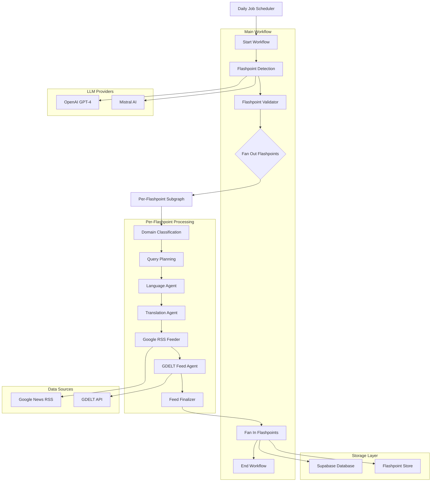
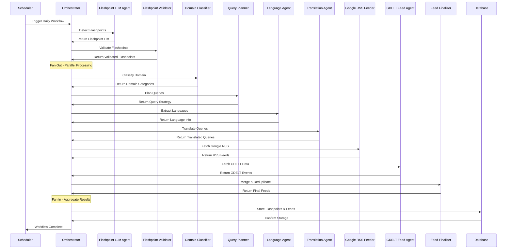

# 🧠 MASX AI – GLOBAL SIGNAL GENERATOR

[](https://github.com/masxai/masx-ai-server)
[](LICENSE)
[](https://www.python.org/downloads/)
[](https://github.com/langchain-ai/langgraph)
[](https://mistral.ai/)
[](https://openai.com/)

> **Autonomous Global Intelligence Platform** - 24/7 flashpoint detection, analysis, and forecasting using multi-agent AI orchestration

## 📋 Table of Contents

- [Overview](#-overview)
- [Features](#-features)
- [Architecture](#-architecture)
- [Technologies](#-technologies)
- [How It Works](#-how-it-works)
- [Installation](#-installation)
- [Usage](#-usage)
- [Examples](#-examples)
- [Roadmap](#-roadmap)
- [Contributing](#-contributing)
- [License](#-license)

## 🧠 Overview

**MASX AI GSG** is a proprietary strategic intelligence system that autonomously monitors, analyzes, and forecasts global geopolitical flashpoints using advanced multi-agent AI orchestration.

The system performs a full-scale internet scan daily at 00:00 UTC, continuously processing real-time geopolitical data to detect, extract, and classify emerging flashpoints. It identifies critical news signals across all regions and languages, and generates a curated list of language-aware, entity-driven news feed URLs for each flashpoint.

### Core Capabilities

- **🔍 Real-time Flashpoint Detection**: Automated identification of emerging global tensions
- **🧠 Multi-Agent Intelligence**: Coordinated AI agents for specialized analysis
- **🌍 Multi-Source Data Fusion**: GDELT, Google News, RSS feeds, and custom sources
- **🔤 Multilingual Processing**: 100+ language support with automatic translation
- **📥 RSS Feed Generation**: Produces thousands of validated news feed URLs per flashpoint
- **⚡ Autonomous Operation**: Self-triggering workflows with intelligent scheduling

## 🚀 Features

### Agentic Intelligence
- **Flashpoint LLM Agent**: Identifies emerging global tensions using LLM reasoning
- **Flashpoint Validator Agent**: Validates and filters flashpoints for relevance
- **Domain Classifier Agent**: Categorizes geopolitical events and threats
- **Query Planner Agent**: Orchestrates multi-step intelligence gathering
- **Language Agent**: Extracts and identifies languages from entities
- **Translation Agent**: Translates queries to target languages
- **Google RSS Feeder Agent**: Fetches news from Google RSS feeds
- **GDELT Feed Agent**: Retrieves events from GDELT API
- **Feed Finalizer Agent**: Merges and deduplicates feed entries

### Autonomous Workflows
- **Daily Intelligence Cycle**: Automated 24/7 monitoring and analysis
- **Flashpoint Detection**: LLM-powered identification of global tensions
- **Fan-Out/Fan-In Pattern**: Parallel processing of multiple flashpoints with aggregation
- **Subgraph Processing**: Each flashpoint processed through dedicated subgraph
- **Multi-Source Fusion**: Google RSS + GDELT data aggregation
- **Feed Generation**: Production of thousands of validated news feed URLs
- **Database Storage**: Automated storage to Supabase with daily table management

### LLM Integrations
- **OpenAI GPT-4**: Primary reasoning and analysis engine
- **Mistral AI**: Secondary analysis and validation
- **Multi-Model Orchestration**: Intelligent model selection and fallback
- **Doctrine-Based Reasoning**: Structured analytical frameworks
- **Context-Aware Processing**: Intelligent context management

## 🏗 Architecture



## 📦 Technologies

### Core Framework
- **[LangGraph](https://github.com/langchain-ai/langgraph)** - Multi-agent orchestration and workflow management
- **[LangChain](https://github.com/langchain-ai/langchain)** - LLM integration and prompt engineering
- **[OpenAI](https://openai.com/)** - GPT-4 for advanced reasoning and analysis
- **[Mistral AI](https://mistral.ai/)** - Secondary LLM for validation and analysis

### Data Processing
- **[spaCy](https://spacy.io/)** - Natural language processing and entity recognition
- **[Transformers](https://huggingface.co/transformers)** - Tokenization and translation models
- **[Sentence Transformers](https://www.sbert.net/)** - Semantic similarity and clustering
- **[Pandas](https://pandas.pydata.org/)** - Data manipulation and analysis
- **[NumPy](https://numpy.org/)** - Numerical computing
- **[Hugging Face Models](https://huggingface.co/)** - Entity detection and NLLB translation models

### Data Sources
- **[GDELT](https://www.gdeltproject.org/)** - Global Database of Events, Language, and Tone
- **[Google News RSS](https://news.google.com/)** - Real-time news feeds
- **[Feedparser](https://feedparser.readthedocs.io/)** - RSS/Atom feed processing
- **[Newspaper3k](https://newspaper.readthedocs.io/)** - Article extraction and processing
- **[Google Search API](https://developers.google.com/custom-search)** - Web search for flashpoint detection

### Storage & Infrastructure
- **[Supabase](https://supabase.com/)** - PostgreSQL database and real-time features
- **[AsyncPG](https://asyncpg.readthedocs.io/)** - High-performance async PostgreSQL
- **[SQLAlchemy](https://www.sqlalchemy.org/)** - Database ORM and migrations

### Language & Translation
- **[Deep Translator](https://deep-translator.readthedocs.io/)** - Multi-language translation
- **[LangDetect](https://github.com/Mimino666/langdetect)** - Language detection
- **[PyCountry](https://pypi.org/project/pycountry/)** - Country and language utilities
- **[Country Converter](https://github.com/konstantinstadler/country_converter)** - Country code conversion
- **[NLLB Translation](https://huggingface.co/facebook/nllb-200-distilled-600M)** - Facebook's No Language Left Behind model

### Scheduling & Orchestration
- **[APScheduler](https://apscheduler.readthedocs.io/)** - Task scheduling and job management
- **[Nest Asyncio](https://github.com/erdewit/nest_asyncio)** - Nested event loop support

## 🧪 How It Works

### Workflow Architecture

The MASX AI system uses a sophisticated **Fan-Out/Fan-In** pattern with **subgraph processing**:

1. **Main Workflow**: Orchestrates the overall process
   - Start → Flashpoint Detection → Flashpoint Validation → Fan-Out
   - Fan-In → End

2. **Per-Flashpoint Subgraph**: Processes each flashpoint in parallel
   - Domain Classification → Query Planning → Language Agent → Translation Agent
   - Google RSS Feeder → GDELT Feed Agent → Feed Finalizer

3. **Parallel Execution**: Multiple flashpoints processed concurrently
4. **Result Aggregation**: All results collected and stored in database

### Agent Collaboration System



### Agent Specializations

#### ⚡ Flashpoint LLM Agent
- **Purpose**: Identifies emerging global tensions using LLM reasoning
- **Capabilities**: LLM-powered flashpoint detection, iterative refinement, search optimization
- **Services**: LLM Service + Google Search API
- **Input**: Global tension queries and search parameters
- **Output**: Curated list of flashpoints with descriptions and entities

#### ✅ Flashpoint Validator Agent
- **Purpose**: Validates and filters flashpoints for relevance
- **Capabilities**: Relevance scoring, duplicate detection, quality filtering
- **Services**: LLM Service
- **Input**: Raw flashpoint list from LLM agent
- **Output**: Validated and filtered flashpoint dataset

#### 🎯 Domain Classifier Agent
- **Purpose**: Categorizes geopolitical events and threats
- **Capabilities**: Event classification, threat assessment, priority ranking
- **Services**: LLM Service
- **Input**: Flashpoint data with title and description
- **Output**: Domain categories and classifications

#### 🧠 Query Planner Agent
- **Purpose**: Orchestrates multi-step intelligence gathering
- **Capabilities**: Query optimization, source selection, workflow planning
- **Services**: LLM Service
- **Input**: Flashpoint data with entities and domains
- **Output**: Optimized query strategies for multiple sources

#### 🌐 Language Agent
- **Purpose**: Extracts and identifies languages from entities
- **Capabilities**: Language detection, entity-language mapping, query localization
- **Services**: LLM Service + Hugging Face Models (Entity Detection)
- **Input**: Query states with entities
- **Output**: Language-aware query states

#### 🔤 Translation Agent
- **Purpose**: Translates queries to target languages
- **Capabilities**: Multi-language translation, query adaptation, language optimization
- **Services**: Translation Service (facebook/nllb-200-distilled-600M)
- **Input**: Language-aware query states
- **Output**: Translated queries for multiple languages

#### 📰 Google RSS Feeder Agent
- **Purpose**: Fetches news from Google RSS feeds
- **Capabilities**: RSS feed aggregation, content extraction, source validation
- **Services**: Feed Parser Service + Google RSS URL Generation
- **Input**: Translated queries
- **Output**: Google RSS feed entries with metadata

#### 📊 GDELT Feed Agent
- **Purpose**: Retrieves events from GDELT database
- **Capabilities**: GDELT API integration, event filtering, temporal analysis
- **Services**: GDELT API
- **Input**: Translated queries
- **Output**: GDELT event entries with geopolitical data

#### 🔗 Feed Finalizer Agent
- **Purpose**: Merges and deduplicates feed entries
- **Capabilities**: Content deduplication, feed merging, quality filtering
- **Services**: Internal Processing (No External Services)
- **Input**: Google RSS and GDELT feed entries
- **Output**: Finalized, deduplicated feed dataset

## 🛠 Installation

### Prerequisites

- **Python 3.9+**
- **PostgreSQL 12+** (or Supabase account)
- **OpenAI API Key**
- **Mistral AI API Key** (optional)
- **Google Search API Key** (optional)

### Quick Start

1. **Clone the Repository**
   ```bash
   git clone https://github.com/masxai/masx-ai-server.git
   cd masx-ai-server/modules/ai-global-signal-grid/agent_hub
   ```

2. **Create Virtual Environment**
   ```bash
   python -m venv venv
   source venv/bin/activate  # On Windows: venv\Scripts\activate
   ```

3. **Install Dependencies**
   ```bash
   pip install -r requirements.txt
   ```

4. **Install spaCy Models**
   ```bash
   python -m spacy download en_core_web_sm
   ```

5. **Configure Environment**
   ```bash
   cp env.example .env
   # Edit .env with your API keys and configuration
   ```

6. **Initialize Database**
   ```bash
   # Set up Supabase or local PostgreSQL
   # Update database connection in .env
   ```

### Environment Configuration

Create a `.env` file with the following variables:

```env
# Core Configuration
ENVIRONMENT=development
DEBUG=true
LOG_LEVEL=INFO

# API Keys
OPENAI_API_KEY=your_openai_api_key_here
MISTRAL_API_KEY=your_mistral_api_key_here
GOOGLE_SEARCH_API_KEY=your_google_search_api_key_here

# Database (Supabase)
SUPABASE_URL=https://your-project.supabase.co
SUPABASE_ANON_KEY=your_supabase_anon_key_here
SUPABASE_SERVICE_ROLE_KEY=your_supabase_service_role_key_here

# External APIs
GDELT_API_KEY=your_gdelt_api_key_here
GOOGLE_TRANSLATE_API_KEY=your_google_translate_api_key_here

# Scheduling
DAILY_RUN_TIME=00:00
TIMEZONE=UTC
ENABLE_SCHEDULER=true
```

## ▶️ Usage

### Running the System

The application is designed to run continuously via the daily job scheduler:

```bash
# Start the daily job scheduler (recommended for production)
python daily_job.py
```

### Manual Execution

For testing and development:

```bash
# Run a single workflow execution
python main_debug.py

# Run flashpoint detection specifically
python main_flashpoint_debug.py
```

### Configuration Options

The system can be configured through environment variables:

- **`ENVIRONMENT`**: `development`, `staging`, `production`
- **`DAILY_RUN_TIME`**: Time for daily execution (HH:MM format)
- **`ENABLE_SCHEDULER`**: Enable/disable automatic scheduling
- **`USE_GDELT`**: Enable/disable GDELT integration
- **`USE_TRANSLATOR`**: Enable/disable translation services

### Monitoring and Logs

The system provides comprehensive logging:

```bash
# View real-time logs
tail -f logs/masx.log

# Check scheduler status
ps aux | grep daily_job.py
```

## 📊 Examples

### Flashpoint Detection Output

```json
{
  "flashpoint_id": "fp_2025_01_15_001",
  "timestamp": "2025-01-15T08:30:00Z",
  "title": "Escalating tensions in Eastern Ukraine",
  "description": "Increased military activity and border incidents in Eastern Ukraine",
  "entities": ["Ukraine", "Russia", "Eastern Europe", "military"],
  "domains": ["conflict", "geopolitics", "military"],
  "queries": [
    {
      "query": "Ukraine Russia border tension",
      "language": "en",
      "translated_queries": {
        "uk": "Україна Росія напруженість кордону",
        "ru": "Украина Россия напряженность границы"
      },
      "google_feed_entries": [
        {
          "url": "https://news.google.com/...",
          "title": "Ukraine reports border incidents",
          "seendate": "2025-01-15T08:30:00Z",
          "domain": "reuters.com",
          "language": "en",
          "sourcecountry": "US"
        }
      ],
      "gdelt_feed_entries": [
        {
          "url": "https://gdeltproject.org/...",
          "title": "GDELT: Increased conflict mentions",
          "seendate": "2025-01-15T08:30:00Z",
          "domain": "gdeltproject.org",
          "language": "en",
          "sourcecountry": "US"
        }
      ]
    }
  ],
  "feed_entries": [
    {
      "url": "https://news.google.com/...",
      "title": "Ukraine reports border incidents",
      "seendate": "2025-01-15T08:30:00Z",
      "domain": "reuters.com",
      "language": "en",
      "sourcecountry": "US",
      "description": "Latest developments in Eastern Ukraine..."
    }
  ]
}
```

### Agent Collaboration Example

```python
# Example of agent orchestration
from app.workflows.orchestrator import MASXOrchestrator

# Initialize the orchestrator
orchestrator = MASXOrchestrator()

# Run the daily intelligence workflow
result = orchestrator.run_daily_workflow({
    "max_iterations": 10,
    "target_flashpoints": 20
})

# Access results
flashpoints = result.get("final_data", [])
flashpoint_count = len(flashpoints)

# Each flashpoint contains:
# - title, description, entities, domains
# - queries with translated versions
# - google_feed_entries and gdelt_feed_entries
# - final merged feed_entries
```

## 🧩 Future Work

### Planned Features

#### Q1 2025
- **🔮 Advanced Forecasting**: ML-powered geopolitical prediction models
- **🌐 Multi-Modal Analysis**: Image and video intelligence processing
- **🤖 Autonomous Agents**: Self-improving agent capabilities
- **📱 Real-time Alerts**: Push notifications and mobile integration

#### Q2 2025
- **🔗 API Integration**: RESTful API for external integrations
- **📊 Advanced Analytics**: Interactive dashboards and reporting
- **🌍 Global Coverage**: Expanded source coverage and languages
- **🔒 Enhanced Security**: Advanced encryption and access controls

#### Q3 2025
- **🧠 Cognitive Computing**: Advanced reasoning and decision support
- **📈 Predictive Modeling**: Long-term trend forecasting
- **🤝 Collaboration Tools**: Multi-user intelligence sharing
- **⚡ Edge Computing**: Distributed processing capabilities

### Research Areas

- **Multi-Agent Learning**: Collaborative agent improvement
- **Causal Inference**: Understanding geopolitical causality
- **Temporal Modeling**: Time-series analysis and forecasting
- **Cross-Lingual Intelligence**: Multi-language understanding

## 🤝 Contributing

### Development Setup

1. **Fork the Repository**
   ```bash
   git clone https://github.com/your-username/masx-ai-server.git
   cd masx-ai-server
   ```

2. **Install Development Dependencies**
   ```bash
   pip install -r requirements.txt
   # Uncomment development dependencies in requirements.txt
   ```

3. **Set Up Pre-commit Hooks**
   ```bash
   pre-commit install
   ```

4. **Run Tests**
   ```bash
   pytest tests/
   ```

### Code Standards

- **Python**: Follow PEP 8 style guidelines
- **Documentation**: Comprehensive docstrings and type hints
- **Testing**: Minimum 80% code coverage
- **Commits**: Conventional commit messages

### Pull Request Process

1. Create a feature branch from `main`
2. Implement changes with tests
3. Update documentation
4. Submit pull request with detailed description
5. Address review feedback
6. Merge after approval

## ⚖️ License

**Copyright (c) 2025 Ateet Vatan Bahmani**

This project is proprietary software developed and owned by Ateet Vatan Bahmani. The source code, documentation, workflows, designs, and naming (including "MASX AI") are protected by applicable copyright and trademark laws.

**Redistribution, modification, commercial use, or publication of any portion of this project without explicit written consent is strictly prohibited.**

This project is not open-source and is intended solely for internal, research, or demonstration use by the author.

**Contact**: ab@masxai.com | [MASXAI.com](https://masxai.com)

---

<div align="center">

**Built with ❤️ by the MASX AI Team**

[Website](https://masxai.com) • [Documentation](https://docs.masxai.com) • [Support](mailto:ab@masxai.com)

</div> 