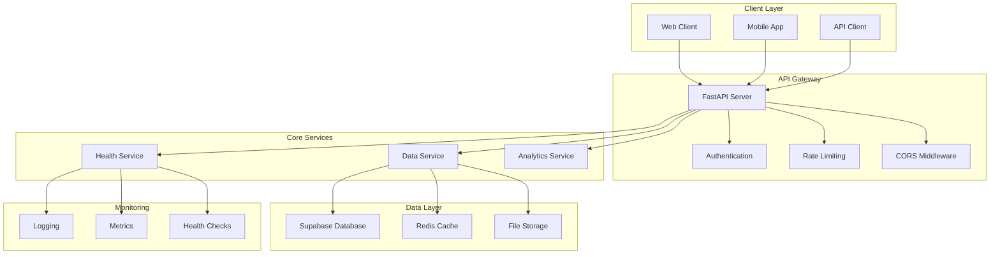

# MASX AI - GSG – Global Signal Grid API

[](https://fastapi.tiangolo.com/)
[](https://www.python.org/)
[](LICENSE)

> **Proprietary Software** - Copyright (c) 2025 Ateet Vatan Bahmani. All rights reserved.

## 📋 Table of Contents

- [Overview](#overview)
- [System Architecture](#system-architecture)
- [Features](#features)
- [Quick Start](#quick-start)
- [API Documentation](#api-documentation)
- [Configuration](#configuration)
- [Development](#development)
- [Deployment](#deployment)
- [Contributing](#contributing)
- [License](#license)

## 🎯 Overview

**MASX AI** is a proprietary **Strategic Agentic AI System** that powers the **Global Signal Grid (GSG)** — a real-time geopolitical intelligence engine.

The **GSG API** provides programmatic access to the system’s autonomous outputs, including:

- 🌍 **Detected Global Flashpoints**  
  Geopolitical hotspots identified through AI-driven signal detection.

- 📰 **Multilingual News Signals**  
  Cross-lingual feeds parsed, translated, and ranked by region, theme, and strategic weight.

- 🧠 **Strategic Feed Clusters**  
  Context-aware groupings of related events aligned with global doctrines and flashpoint domains.

This **FastAPI-based service** allows external systems, dashboards, and analysts to:
- Access real-time global intelligence
- Trigger strategic workflows
- Integrate MASX signals into decision-making systems

---

## 🏗️ System Architecture



## ✨ Features

### Core Features
- **RESTful API**: Complete REST API with OpenAPI documentation
- **Authentication**: Secure API key-based authentication
- **CORS Support**: Cross-origin resource sharing configuration
- **Request Logging**: Comprehensive request/response logging
- **Error Handling**: Structured error responses and exception handling

### Data Management
- **Data Retrieval**: Efficient data fetching and processing
- **Analytics**: Advanced data analytics and insights
- **Caching**: Redis-based caching for improved performance
- **Database Integration**: Supabase PostgreSQL integration

### Monitoring & Observability
- **Health Checks**: Comprehensive system health monitoring
- **Metrics Collection**: Performance metrics and analytics
- **Structured Logging**: JSON-based logging with structlog
- **Error Tracking**: Detailed error reporting and debugging

## 🚀 Quick Start

### Prerequisites

- Python 3.9 or higher
- pip (Python package installer)
- Git

### Installation

1. **Clone the repository**
   ```bash
   git clone <repository-url>
   cd masx-ai-server
   ```

2. **Create virtual environment**
   ```bash
   python -m venv venv
   source venv/bin/activate  # On Windows: venv\Scripts\activate
   ```

3. **Install dependencies**
   ```bash
   pip install -r requirements.txt
   ```

4. **Set up environment variables**
   ```bash
   cp .env.example .env
   # Edit .env with your configuration
   ```

5. **Run the application**
   ```bash
   python main.py
   ```

The API will be available at `http://localhost:8000`

### Docker Deployment

```bash
# Build the image
docker build -t masx-ai-server .

# Run the container
docker run -p 8000:8000 --env-file .env masx-ai-server
```

## 📚 API Documentation

### Interactive Documentation

Once the server is running, you can access:

- **Swagger UI**: `http://localhost:8000/docs`
- **ReDoc**: `http://localhost:8000/redoc`
- **OpenAPI JSON**: `http://localhost:8000/openapi.json`

### Available Endpoints

#### Health Check
- `GET /health` - System health status
- `GET /health/detailed` - Detailed health information

#### Data Management
- `GET /api/data/flashpoints`  
  Retrieve all flashpoints with optional filters (`date`, `run_id`) and pagination.

- `GET /api/data/flashpoints/{flashpoint_id}/feeds`  
  Retrieve feeds related to a specific flashpoint (by UUID).

- `GET /api/data/feeds` 
  Retrieve all feeds with support for filtering (`language`, `domain`) and pagination.

- `GET /api/data/stats`  
  Get statistics for flashpoints and feeds (totals, language/domain breakdowns).


## ⚙️ Configuration

### Environment Variables

Key configuration options in `.env`:

```env
# API Configuration
API_HOST=0.0.0.0
API_PORT=8000
API_SECRET_KEY=your-secret-key
GSG_API_KEY=your-gsg-api-key

# Database Configuration
SUPABASE_URL=your-supabase-url
SUPABASE_ANON_KEY=your-supabase-anon-key
SUPABASE_SERVICE_ROLE_KEY=your-service-role-key

# AI Provider Configuration
OPENAI_API_KEY=your-openai-api-key
ANTHROPIC_API_KEY=your-anthropic-api-key

# Logging Configuration
LOG_LEVEL=INFO
LOG_FORMAT=json
```

### Configuration Validation

The system includes comprehensive configuration validation:

- Environment-specific settings
- Type validation for all parameters
- Default values for development
- Security best practices

## 🛠️ Development

### Project Structure

```
masx-ai-server/
├── app/
│   ├── api/
│   │   ├── app.py          # FastAPI application factory
│   │   └── routes/         # API route handlers
│   ├── config/
│   │   ├── settings.py     # Configuration management
│   │   └── logging_config.py # Logging configuration
│   └── core/
│       └── exceptions.py   # Custom exceptions
├── main.py                 # Application entry point
├── requirements.txt        # Python dependencies
├── .env.example           # Environment template
└── README.md              # This file
```

### Development Commands

```bash
# Run in development mode
python main.py

# Run with hot reload
uvicorn main:app --reload --host 0.0.0.0 --port 8000

# Run tests
pytest

# Code formatting
black .
isort .

# Linting
flake8 .
mypy .
```

### Testing

```bash
# Run all tests
pytest

# Run with coverage
pytest --cov=app

# Run specific test file
pytest tests/test_api.py

# Run with verbose output
pytest -v
```

## 🚀 Deployment

### Production Deployment

1. **Environment Setup**
   ```bash
   export ENVIRONMENT=production
   export DEBUG=false
   export LOG_LEVEL=INFO
   ```

2. **Database Migration**
   ```bash
   alembic upgrade head
   ```

3. **Start Production Server**
   ```bash
   uvicorn main:app --host 0.0.0.0 --port 8000 --workers 4
   ```

### Docker Production

```bash
# Build production image
docker build -t masx-ai-server:prod .

# Run with production settings
docker run -d \
  --name masx-ai-server \
  -p 8000:8000 \
  --env-file .env.prod \
  masx-ai-server:prod
```

### Monitoring

- **Health Checks**: `/health` endpoint for load balancers
- **Metrics**: Prometheus-compatible metrics at `/metrics`
- **Logging**: Structured JSON logging for log aggregation

## 🤝 Contributing

This is a proprietary project. For internal contributions:

1. Follow the established code style (Black, isort)
2. Write comprehensive tests
3. Update documentation
4. Ensure all tests pass
5. Submit for review

### Code Style

- **Python**: Follow PEP 8 with Black formatting
- **Type Hints**: Use type hints throughout
- **Documentation**: Comprehensive docstrings
- **Testing**: Minimum 80% code coverage

## 📄 License

**Proprietary Software** - Copyright (c) 2025 Ateet Vatan Bahmani

This software is proprietary and confidential. All rights reserved.

- **Redistribution**: Prohibited without explicit written consent
- **Modification**: Prohibited without explicit written consent  
- **Commercial Use**: Prohibited without explicit written consent
- **Publication**: Prohibited without explicit written consent

**Contact**: ab@masxai.com | [MASXAI.com](https://masxai.com)

---

<div align="center">

  <strong>Built with ⚡⚡⚡ by <a href="https://ateetai.vercel.app/" target="_blank">Ateet Bahamani</a></strong>  
  <em>Strategic Agentic AI System for the Future</em>  

  🌐🌐🌐 [Portfolio](https://ateetai.vercel.app/)

</div>